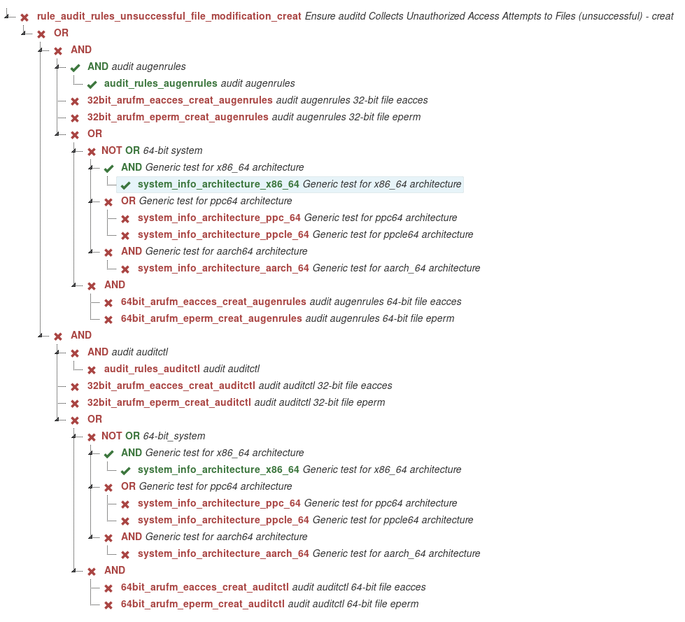

# OVAL visualization as graph
[](https://scrutinizer-ci.com/g/OpenSCAP/OVAL-visualization-as-graph/?branch=master) [](https://scrutinizer-ci.com/g/OpenSCAP/OVAL-visualization-as-graph/?branch=master) [](https://scrutinizer-ci.com/g/OpenSCAP/OVAL-visualization-as-graph/build-status/master) [](https://scrutinizer-ci.com/code-intelligence)

Understanding result in the blink of an eye

### How use?
```
Command:
    python3 run.py ARF-file.xml id-rule
Example:
    python3 run.py data/ssg-fedora-ds-arf.xml xccdf_org.ssgproject.content_rule_disable_host_auth
```
* *ARF-file.xml* -  ARF xml report from OpenSCAP scan. 
* *id-rule*  - Rule ID to be visualized. You can input part of ID rule or use regular expresion,but if you use in regular expresion brackets. You must put regular expression betwen quotation marks.

It open web browser with graph. Default is Firefox. If Firefox not installed it open default web browser in OS.  

* ### Minimal requires:
  * **python3**
  * lxml

* ### Recommended requires:
  * include minimal requires
  * PyInquirer
  * python3-devel.x86_64 **(If fail installation PyInquirer.)**
