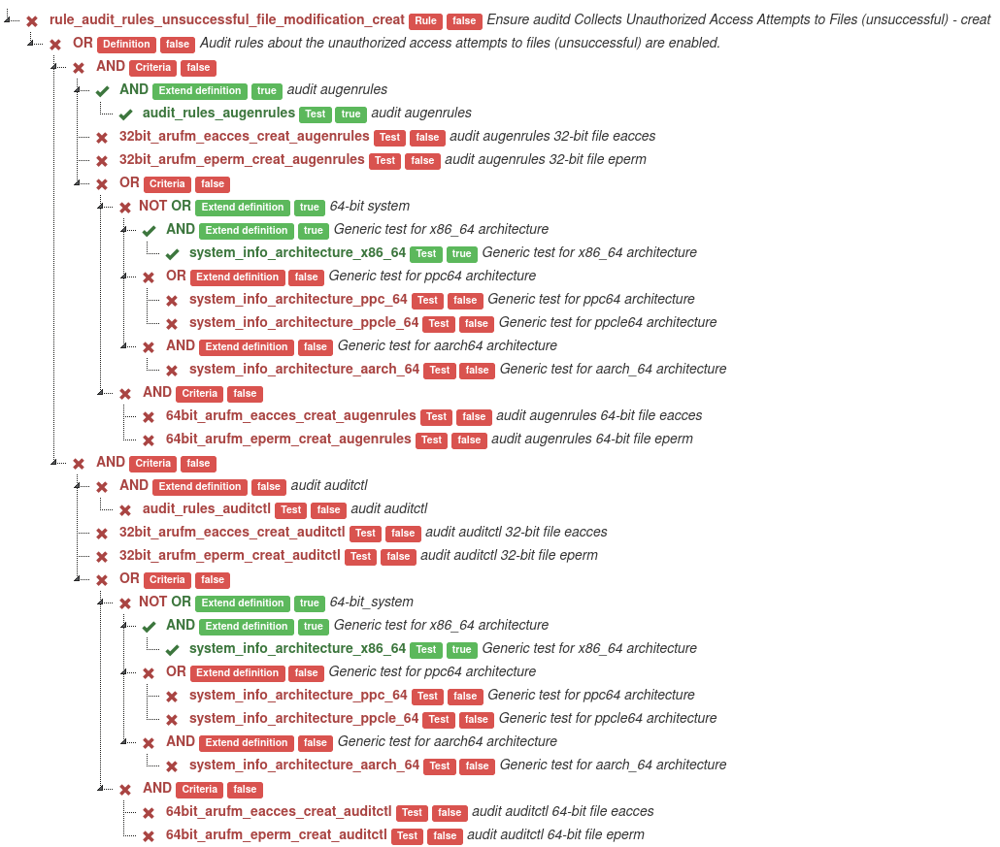

# OVAL visualization as graph

Understanding result in the blink of an eye

[](https://scrutinizer-ci.com/g/OpenSCAP/OVAL-visualization-as-graph/?branch=master) [](https://scrutinizer-ci.com/g/OpenSCAP/OVAL-visualization-as-graph/?branch=master) [](https://scrutinizer-ci.com/g/OpenSCAP/OVAL-visualization-as-graph/build-status/master) [](https://scrutinizer-ci.com/code-intelligence)

## Visualization of SCAP rule evaluation results

This tool generates a tree graph from ARF xml report from OpenSCAP scan.

### [More information in the Guide.](docs/GUIDE.md)

## Installation

### Fedora 30 and later

```bash
sudo dnf install oval-graph
# Install inquirer, if you want have nice cli features. (optional)
sudo pip3 install inquirer
```

### Installation via [pip](https://pypi.org/project/oval-graph/)

```bash
# If you want to install oval-graph to $HOME/.local/bin, you have to run the below command:
pip3 install --user oval-graph
# Install inquirer, if you want have nice cli features. (optional)
pip3 install --user inquirer

# If you want to install oval-graph globally instead, you have to run the below commands as admin, e.g. on Linux:
sudo pip3 install oval-graph
# Install inquirer, if you want have nice cli features. (optional)
sudo pip3 install inquirer

```

### Installation from source

```bash
git clone https://github.com/OpenSCAP/OVAL-visualization-as-graph.git
cd OVAL-visualization-as-graph

# Install without features (light version)
sudo pip3 install .

# OR

# Install with nice cli features
sudo pip3 install ".[niceCli]"
```

## Example usage

> More usage examples are in user [Guide](./docs/GUIDE.md)

This commands consumes the rule name or regular expression of rule name and the ARF file, which is one of possible standardized format for results of SCAP-compliant scanners. You can read about generating ARF report files using OpenSCAP in the OpenSCAP User [Manual](https://github.com/OpenSCAP/openscap/blob/maint-1.3/docs/manual/manual.adoc). Or you can use test arf files from repository `/tests/test_data`.  

```bash
arf-to-graph scan-data/ssg-fedora-ds-arf.xml xccdf_org.ssgproject.content_rule_audit_rules_unsuccessful_file_modification_creat
```

This command generates a graph and saves file named  `graph-of-<rule_id>-<date>.html` (The date the graph was created.) in the working directory. Then open the web browser. _Default web browser is Firefox. If Firefox not installed it opens default web browser in OS._


