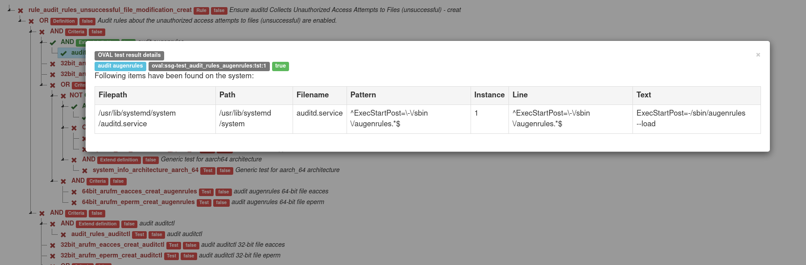
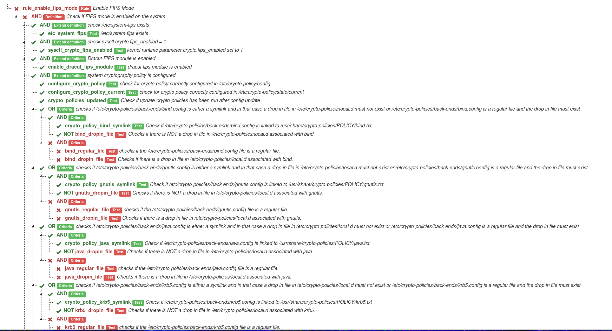
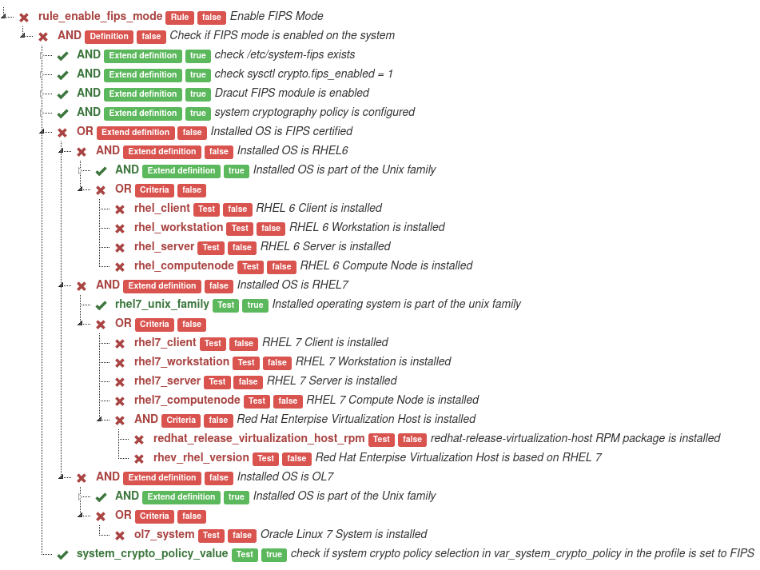

# Welcome to the oval-graph guide

This tool generates an [OVAL](https://oval.cisecurity.org/) result in the form of a tree graph from an ARF xml report from an OpenSCAP scan.

## Prerequisites

### Required dependencies

- **python3**
- [lxml](https://pypi.org/project/lxml/)

### Optional dependencies

- includes required dependencies
- [inquirer](https://pypi.org/project/inquirer/)

## Installation

### Enterprise Linux

**Before installing, enable Extra Packages for Enterprise Linux (EPEL). Learn how to enable EPEL in [EPEL documentation](https://fedoraproject.org/wiki/EPEL).**

### Enable EPEL for RHEL/CentOS 8

Run these commands as root. Enable EPEL for RHEL/CentOS 7 is very similar.

```bash
yum install https://dl.fedoraproject.org/pub/epel/epel-release-latest-8.noarch.rpm
```

on RHEL 8 it is required to also enable the codeready-builder-for-rhel-8-*-rpms repository since EPEL packages may depend on packages from it:

```bash
subscription-manager repos --enable "codeready-builder-for-rhel-8-$(/bin/arch)-rpms"
```

#### RHEL/CentOS 7

```bash
sudo yum install oval-graph
```

#### RHEL/CentOS 8 /Fedora 30 and later

```bash
sudo dnf install oval-graph
```

##### Install inquirer, if you want have nice cli features. (optional)

```bash
sudo pip3 install inquirer
```

### Installation via [pip](https://pypi.org/project/oval-graph/)

```bash
# If you want to install oval-graph to $HOME/.local/bin, you have to run the below command:
pip3 install --user oval-graph
# Install inquirer, if you want have nice cli features. (optional)
pip3 install --user inquirer

# If you want to install oval-graph globally instead, you have to run the below commands as admin, e.g. on Linux:
sudo pip3 install oval-graph
# Install inquirer, if you want have nice cli features. (optional)
sudo pip3 install inquirer

```

### Installation from source

```bash
git clone https://github.com/OpenSCAP/OVAL-visualization-as-graph.git
cd OVAL-visualization-as-graph

# Install without features (light version)
sudo pip3 install .

# OR

# Install with nice cli features
sudo pip3 install ".[niceCli]"
```

> If you don't want to install anything, look [here](#run-from-source).

## Commands

- [arf-to-graph](#arf-to-graph) Generates a tree graph from ARF xml report
- [arf-to-json](#arf-to-json) Generates a JSON from ARF xml report
- [json-to-graph](#json-to-graph) Generates a tree graph from JSON

### Arguments

Run the utility with `-h` to see what optional args do.

***

## Usage Examples

This commands consumes the rule name or regular expression of rule name and the ARF file, which is one of possible standardized format for results of SCAP-compliant scanners. You can read about generating ARF report files using OpenSCAP in the OpenSCAP User [Manual](https://github.com/OpenSCAP/openscap/blob/maint-1.3/docs/manual/manual.adoc). Or you can use test arf files from repository `/tests/test_data`.

### `arf-to-graph`

This command serves to fast visualization of rule.

```bash
arf-to-graph scan-data/ssg-fedora-ds-arf.xml xccdf_org.ssgproject.content_rule_audit_rules_unsuccessful_file_modification_creat
```

This command generates a graph and saves file named  `graph-of-<rule_id>-<date>.html` (The date the graph was created.) in the working directory. Then, it opens the generated file in your web browser. _Default web browser is Firefox. If Firefox is not installed, the default web browser in OS is used._

```bash
arf-to-graph -o ~/graphs scan-data/ssg-fedora-ds-arf.xml 't.[a-zA-Z0-9_]*on_creat$'
```

This command generates a graph and saves file named `graph-of-<rule_id>-<date>.html` (The date the graph was created.) in `~/graphs` because `-o` was used. Then, it opens the generated file in your web browser. _Default web browser is Firefox. If Firefox is not installed, the default web browser in OS is used._
**Resulting output**


**Click on any test for show OVAL details**


### `arf-to-json`

This command serves to generate a JSON of rule.

```bash
arf-to-json scan-data/ssg-fedora-ds-arf.xml 'on_creat$'
```

This command prints JSON of rule. User can easily transfer the output to file with `>`.

```bash
arf-to-json -o ~/rules.json scan-data/ssg-fedora-ds-arf.xml 'on_creat$'
```

This command saves JSON to `~/rules.json` and, if there are any saved graphs in the file, it joins the other charts because `-o` was used.

### `json-to-graph`

_This command consumes the rule name and the JSON file._

This command serves to restore graph form json of rules.

```bash
json-to-graph ~/rules.json 'on_creat$'
```

This command restores the graph and saves file named `graph-of-<rule_id>-<date>.html` (The date the graph was created.) in working directory. Then, it opens the generated file in your web browser. _Default web browser is Firefox. If Firefox is not installed, the default web browser in OS is used._

```bash
json-to-graph -o ~/graphs ~/rules.json 'on_creat$'
```

This command restore graph and saves all necessary files to a directory named `graph-of-<rule_id>-<date>.html` (The date the graph was created.) in `~/graphs` because `-o` was used. Then, it opens the generated file in your web browser. _Default web browser is Firefox. If Firefox is not installed, the default web browser in OS is used._
> **The resulting output is the same as the previous image.**  

#### Option to hide pass tests in graph

This option is available in ```arf-to-graph``` and ```json-to-graph```. This parameter hides all pass tests for better orientation in graph. (see pictures)

##### Not used  `--hide-passing-tests`



##### Used  `--hide-passing-tests`



## Run from source

**Warning: [Required dependencies](#required-dependencies) must be installed.**

```bash
#get sources
git clone https://github.com/OpenSCAP/OVAL-visualization-as-graph.git
cd OVAL-visualization-as-graph

# run command arf-to-graph -h
python3 -m oval_graph.command_line arf-to-graph -h

# run command arf-to-json -h
python3 -m oval_graph.command_line arf-to-json -h

# run command json-to-graph -h
python3 -m oval_graph.command_line json-to-graph -h

```

## Execute the test suite

There are many test options for syntax, code, code coverage.

### Before testing install requirements

Requirements contain optional dependency `inquirer`. Test suite works differently when is not installed, but when you use `tox`. It runs tests two times when is installed `inquirer` and when is not installed.

```bash
pip3 install -r test_suite_requirements.txt
```

### Test all that stuff together with tox

Run tests:

```bash
tox
```

>If requirements changes ```tox -r``` (recreates virtual environment) can help.

```bash
# Show coverage report
firefox htmlcov/index.html
```

You can run test for more python environments with command like this one:

```bash
tox -e py36,py37,py38,py39
```

### Test code and code coverage with pytest

Run tests:

```bash
python3 -m pytest
```

Run tests coverage:

```bash
python3 -m pytest --cov oval_graph --cov-report html --cov-branch

# Show coverage report
firefox htmlcov/index.html
```

### Test syntax

Run syntax tests:

```bash
flake8 ./oval_graph ./tests setup.py

#OR

pylint ./oval_graph ./tests setup.py
```
